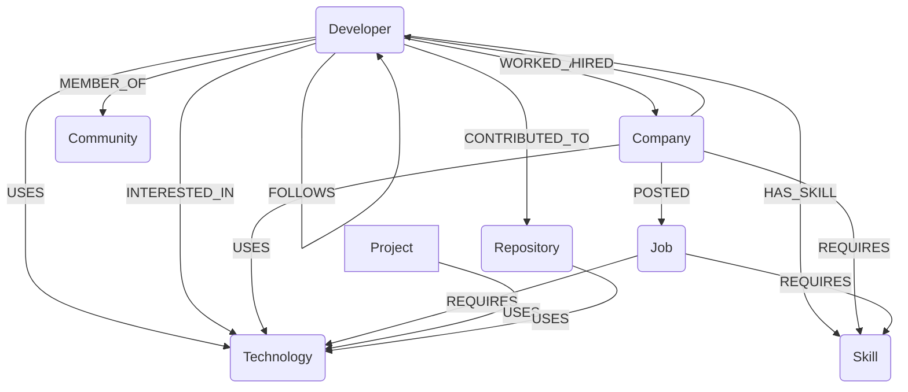

# Wexa Talent Explorer: AI Talent Network Graph

Wexa Talent Explorer is a production-grade talent network navigation app that visualizes professional relations between **Developers**, **Skills**, **Companies**, **Technologies**, and **Jobs** in real-time. By moving away from rigid tabular indexes, this application leverages **CognoDB Cloud** (Neo4j-compatible native Graph Database) to resolve deep recursive paths, mutual referrals, and competency similarity.

---

## Why a Graph Database Over SQL?

This project highlights the core engineering trade-offs between Graph Databases and Relational Databases (SQL) for highly connected networks:

1. **No Cartesian Joins**: Finding a path like `Developer -> Knows -> Developer -> Worked At -> Company -> Requires -> Skill` in SQL requires joining 5 to 6 tables. Each join multiplies the lookup complexity (Cartesian product). In CognoDB/Neo4j, relationships are stored as direct physical pointers on disk (Index-free Adjacency), making traversals take constant time $O(1)$ per hop regardless of total database size.
2. **Recursive Path-finding (Shortest Path)**: To find the shortest connection path between two people in SQL, you must write recursive Common Table Expressions (CTEs), which are complex to maintain and slow. In openCypher, it is solved in a single clean query: `MATCH path = shortestPath((d1:Developer {id: $id1})-[*..6]-(d2:Developer {id: $id2})) RETURN path`.
3. **Dynamic Network Centrality**: Ranking developers by their network influence or degree centrality is computed instantaneously by querying relationships.
4. **Fuzzy Skill Overlaps**: Jaccard similarity metrics (intersection over union) are computed in real-time on skill sub-graphs rather than executing massive grouping statements on multi-way SQL bridge tables.

---

## Architecture Flow

The monorepo uses a decoupled client-server architecture:

```text
               +----------------------------------+
               |        React 19 Frontend         |
               | (Vite, Cytoscape.js, Tailwind)   |
               +----------------------------------+
                                |
                                | API Requests (JWT Auth)
                                v
               +----------------------------------+
               |        Express.js Server         |
               |      (TypeScript, Zod API)       |
               +----------------------------------+
                                |
                                | Bolt Protocol (openCypher)
                                v
               +----------------------------------+
               |       CognoDB Cloud Graph        |
               |   (Index-Free Adjacency Nodes)   |
               +----------------------------------+
```

---

## Graph Schema Diagram (Mermaid)



---

## Core Cypher Queries Used

### 1. Shortest Connection Path
Finding the path between two developers:
```cypher
MATCH path = shortestPath((d1:Developer {id: $from})-[r:KNOWS|COLLABORATED_WITH*..6]-(d2:Developer {id: $to}))
RETURN [node in nodes(path) | {id: node.id, name: node.name, type: labels(node)[0]}] as nodes
```

### 2. Jaccard Skill Similarity + Centrality Rank
```cypher
MATCH (d1:Developer {id: $devId})-[:HAS_SKILL]->(s:Skill)<-[:HAS_SKILL]-(d2:Developer)
WHERE d1 <> d2
WITH d1, d2, count(s) as intersection
MATCH (d1)-[:HAS_SKILL]->(s1:Skill)
WITH d1, d2, intersection, count(s1) as set1Size
MATCH (d2)-[:HAS_SKILL]->(s2:Skill)
WITH d2, intersection, set1Size, count(s2) as set2Size
WITH d2, intersection, (set1Size + set2Size - intersection) as union
WITH d2, (toFloat(intersection) / union) as jaccardSimilarity
OPTIONAL MATCH (d2)-[r:KNOWS]-()
RETURN d2, jaccardSimilarity, (jaccardSimilarity * 0.7 + (count(r) / 50.0) * 0.3) as score
ORDER BY score DESC LIMIT $limit
```

### 3. Multi-Hop Placement recommendations
Friend &rarr; Worked At &rarr; Tech &rarr; Job:
```cypher
MATCH (d:Developer {id: $devId})-[:KNOWS]-(friend:Developer)-[:WORKED_AT]->(c:Company)-[:USES]->(t:Technology)<-[:REQUIRES]-(j:Job)
RETURN friend, c, t, j LIMIT $limit
```

---

## Getting Started

### Prerequisites
- Node.js (v18 or v20+)
- npm / yarn
- Active **CognoDB Cloud** database instance (or local Neo4j instance)

### Installation
1. Clone this repository to your local drive.
2. Run install at monorepo root (configures workspaces):
   ```bash
   npm install
   ```

3. Setup environment files:
   Create a `.env` file in the `server/` directory:
   ```bash
   cp server/.env.example server/.env
   ```
   Add your CognoDB Cloud Bolt URL and credentials to `server/.env`:
   ```env
   PORT=5000
   NEO4J_URI=bolt://<YOUR_COGNODB_HOST>:<PORT>
   NEO4J_USERNAME=your_username
   NEO4J_PASSWORD=your_password
   JWT_SECRET=demo_secret_key_123
   ```

### Seeding the Graph
To clear the database and inject 300+ developers, 50 companies, 100 skills, and over 5,000 dense relationships:
```bash
# Clears the DB and sets indexes/constraints
npm run clear

# Programmatically generates nodes and links in batch UNWIND transactions
npm run seed
```

### Running Locally
To launch both the Express backend server and the Vite React development server concurrently:
```bash
npm run dev
```
- Frontend will serve on: [http://localhost:3000](http://localhost:3000)
- Backend API will serve on: [http://localhost:5000](http://localhost:5000)

---

## Folder Structure

```text
/
├── client/              # React 19 Client App
│   ├── src/
│   │   ├── components/  # Layout, Cards, Cytoscape Canvas explorer
│   │   ├── context/     # JWT Auth State management
│   │   ├── pages/       # Dashboard, Profiles, Explorer Views
│   │   └── main.tsx
│   ├── index.html
│   └── package.json
├── server/              # Express Node Server
│   ├── src/
│   │   ├── config/      # CognoDB Driver Instance manager
│   │   ├── middleware/  # JWT validation, error loggers
│   │   ├── repositories/# BaseRepository pattern with Cypher wrappers
│   │   ├── routes/      # Auth, Developer, Analytics, Graph routes
│   │   └── index.ts
│   └── package.json
├── package.json         # Workspace Monorepo Orchestrator
└── README.md
```
